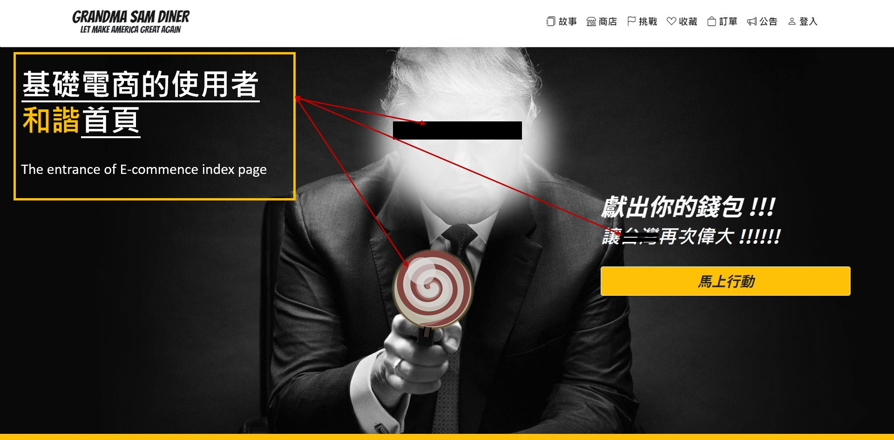
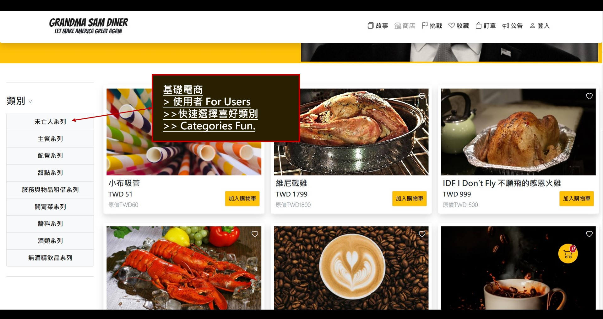
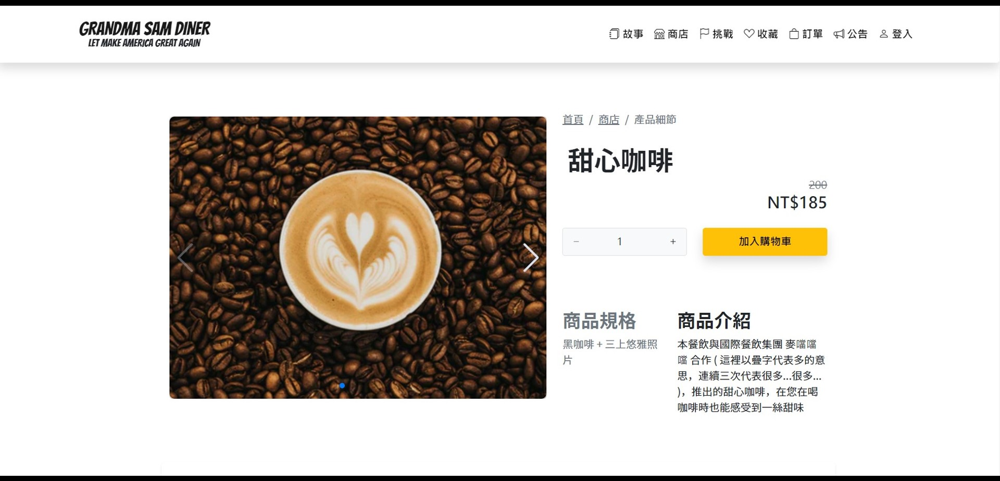
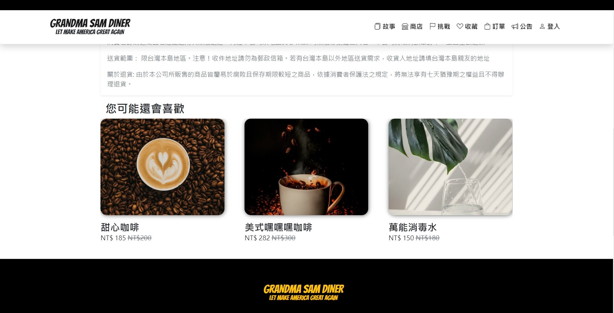
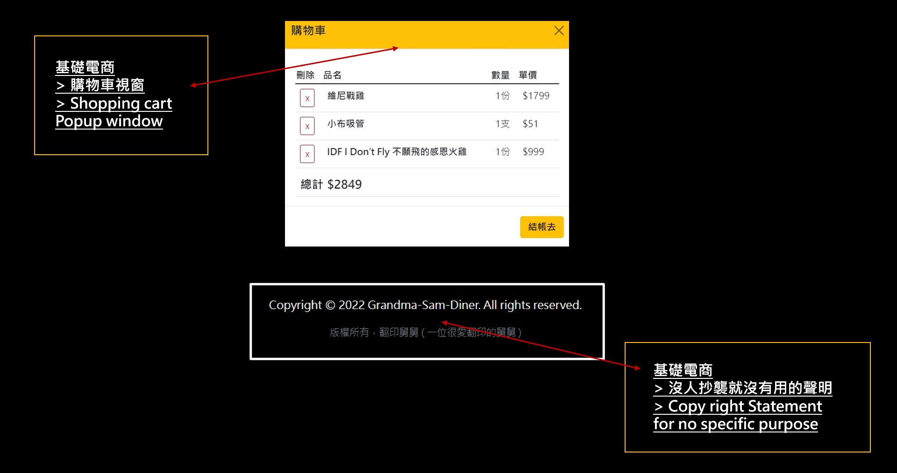
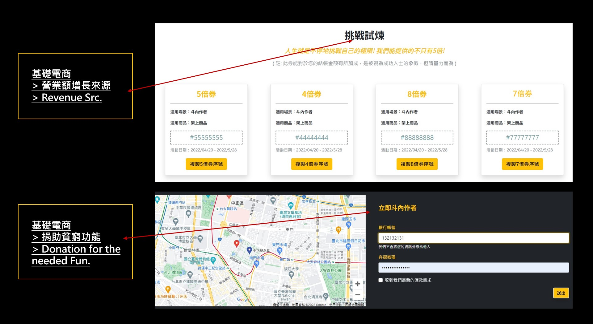
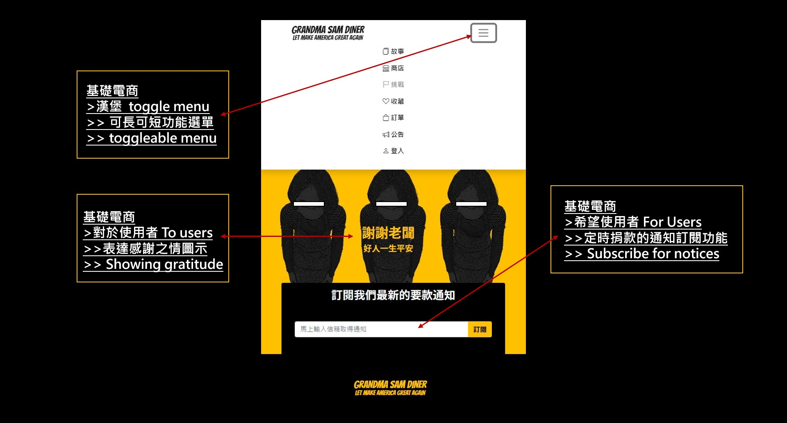
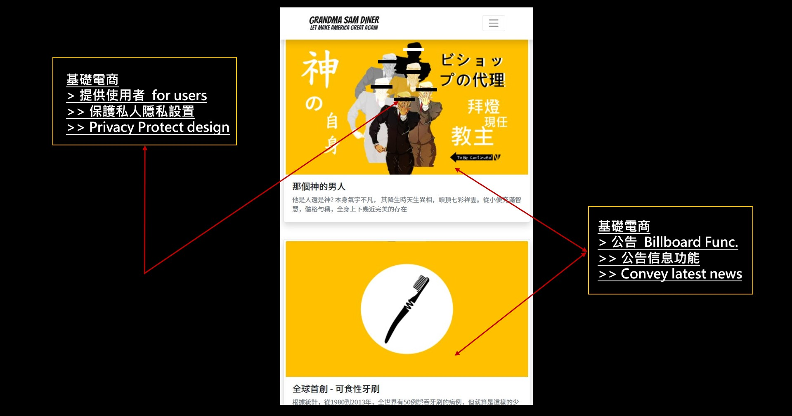
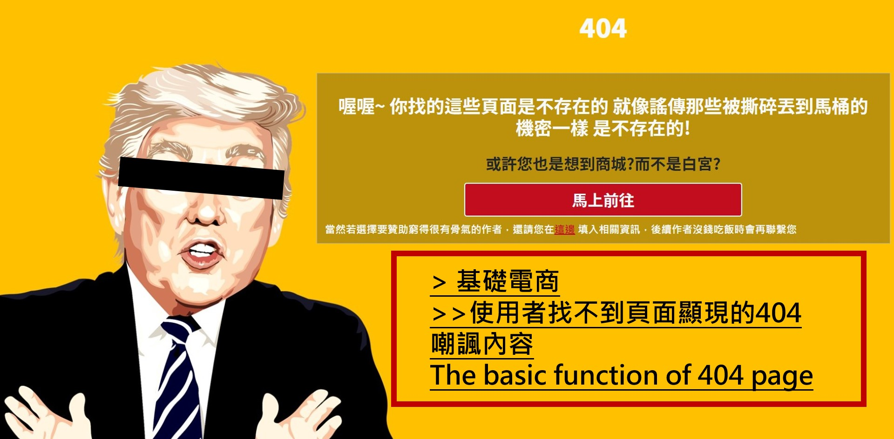

# GrandMaSam_Diner 山姆大嬸餐飲

### 作品介紹 ( Project Intro )

此作創作的初衷為解決敝人的作業繳交問題以及希望藉由此作帶給讀者些許歡樂，畢竟人生苦短，壓力與工作占據了生活大部分時間則是現代人的常態，但周遭的事物卻往往像一套套模板，每天看到的文章與新聞感覺都很類似，像是彼此間事先商量好了一般，久了總有些乏味，而過度包裝的行銷台詞在言詞中總感覺少了些真誠，這邊嘗試以較為跳躍的文字重新塑造了一個全為虛構的餐飲網站，存在於虛擬平行時空中的一隅，而此作本意只為您的莞爾一笑與敝人的舒壓爾爾，但有鑑於每個人看事物的觀點與感受會有所不同，若有任何造成您閱讀後的不適，還請海涵，筆者並無意隱射任何人與事，若有得罪之處還請您見諒!

This project is aiming for practicing of the front-end techniques for the built of B2C E-commerce platform, In the meantime, I had tried to create a fictional diner with some stories by utilizing words to form its content via different point of view intend to entertain the readers like you. I humbly hope it could bring you a slight of happiness after viewing it. For the record, there's no malicious intents implied. Please accept my deeply appology if any offenses you felt, and hope you do enjoy my work!

Cheers

---

### 頁面連結 ( Demo page - built via GitHub page link )

連結: [https://bruno-yu.github.io/GrandMaSam_Diner/#/](https://bruno-yu.github.io/GrandMaSam_Diner/#/)

---

### 基礎功能介紹 ( Basic Function inro. )

- 前台功能: 漢堡選單、購物車、商品展示、訂單功能、結帳流程、管理員登入頁..等。
  ( Front-end function: Toggle nav-bar customized、Shopping cart、products' layputs and demonstarions、checkout process、Admin login...etc. )
- 後台功能: 新增、修改、刪除產品、優惠卷( 挑戰 )管理、訂單管理、公告文章編撰..等。
  ( Back-end function: New-add/Edit/Delete functions for products、Coupons/Orders/News admin pages. )

---

### 頁面展示說明 ( Demo. & Descript.)

( *註: 為保護當事人，以下圖片有進行和諧化處理* ) 

**首頁 Index Page**

* 和諧化技術
  ( Entrance index page built )
* 關鍵字放大再放大功能
  ( Emphasize the main points )

**商品類別功能 ( Sorted by Categories Func. )**

* 挑選使用者嗜好功能
  ( Categories Func. )

**產品頁面說明 ( Product detail info. page )**

* 誘導使用者加入購物車的鮮明陰影設置
  ( Detail the chosen product info for users. )

**產品推薦建議 ( Recommended products area )**

* 類似產品推坑建議
  ( Similar products recommendation )

**購物車視窗功能 ( Shopping Cart content reminder Func. )**

* 告知使用者購買商品資訊/價格，友善提醒他們要有足夠的錢才能購買
  ( inform users for the detail content of the shopping cart along with the total amount. )
* 有人抄襲才有用的奇怪聲明
  ( Proper notice of the copy right statement )

**企業社會責任頁面 Coroporate Social Responsibility page**

* 提供使用者CSR 功能
  ( Save the poor author save the world )

**響應式網頁設計 ( RWD Responsive Web Design )**

* 大俠愛吃漢堡寶選單功能
  ( Toggleable menu for mobile screen )
* 適當表達感謝功能
  ( Decent manners shown )

**後臺公告最新資訊功能 ( Billboard for Admin to update posts to users )**

* 讓管理員公告奇怪產品的展示頁面
  ( The billboard space for admin to demo some news for users )

**404 頁面功能 404 page / Not Found Notice**

* 適當提醒使用者並無此頁的功能
  ( 404 page deigned for users if they were used wrong router links. )

---

### 使用技術 The used Techniques

- VueCli
- VueRouter
- Vue 元件概念 ( Concept of Vue Components applied )
- 串接 API ( Create the links with API )
- bootstrap 5
- RWD
- webpack
- CSS/SCSS、HTML
- ESLint Style - Airbnb ( Note: Not Hotels.com, Booking.com, TripAdivsor, Trivago...etc. )

---

### 使用插件 NPM Plugins

- vee-validate、vee-validate/i18n、vee-validate/rules
- swiper
- vue-axios
- animate.css
- vue-loading-overlay
- mitt
- ckeditor/ckeditor5-build-classic、ckeditor/ckeditor5-vue
- bootstrap、bootstrap-icons

See [Configuration Reference](https://cli.vuejs.org/config/).

---

### 圖片來源 Sources of pics

- unsplash、pixabay...etc.
- self-remade images.

---
